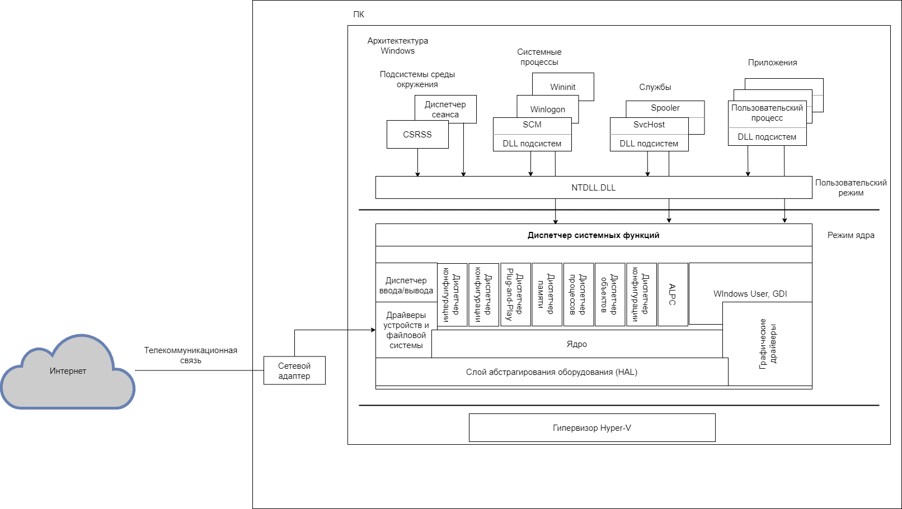

### 1.1 Описание объекта исследования

В настоящее время компьютеры играют непреходящую роль в различных аспектах современного общества. Они являются незаменимыми инструментами для обработки и хранения информации, выполнения сложных вычислительных процессов и обеспечения взаимодействия между пользователями и системами. Компьютеры широко применяются в коммерческой, медицинской, научной и государственной сферах, что подчеркивает их информационную ценность и важность в современном информационном обществе.

ПК представляет собой электронную вычислительную систему, оснащенную современным аппаратным обеспечением, включающим центральный процессор, оперативную память, жесткий диск и периферийные устройства.

Персональный компьютер (ПК) функционирует с использованием операционной системы Windows, являющейся одной из наиболее распространенных систем. Она обеспечивает пользователю удобный интерфейс и доступ к различным приложениям, а также обеспечивает взаимодействие с другими устройствами и сетями.

Операционная система (ОС) - это программное обеспечение, разрабатываемое для эффективного управления ресурсами компьютерной системы и обеспечения безопасности ее функционирования. Она предоставляет интерфейс для работы пользователя с компьютером и представляет механизмы для управления процессами, памятью, файловой системой и другими компонентами. ОС также обеспечивает механизмы защиты данных и контроля доступа, что является важным аспектом в контексте информационной безопасности. Без операционной системы компьютерная система не функционировала бы эффективно и может оказаться уязвимой перед различными угрозами.

Операционная система (ОС) и ее ядро играют важную роль в противодействии угрозам, связанным с руткитами ядра. Операционная система обеспечивает базовые механизмы безопасности, такие как контроль доступа и изоляция процессов, а также обнаружение и предотвращение вирусных атак. Однако руткиты ядра имеют возможность обойти эти механизмы и проникнуть непосредственно в само ядро системы.

<figure>
  
  <em>Архитектура Windows</em>
</figure>