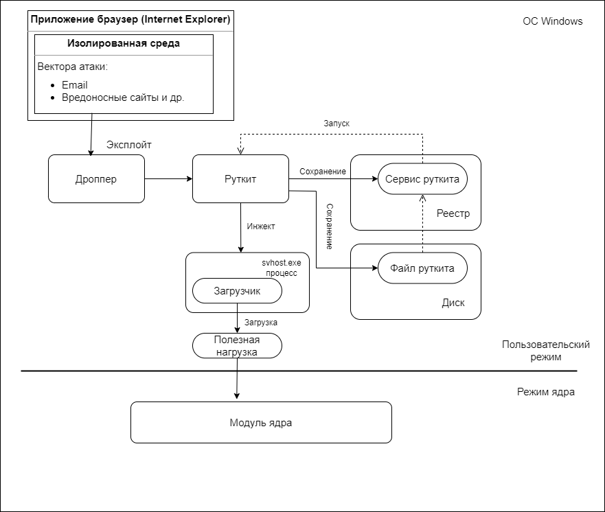

### 1.1 Описание объекта исследования

В настоящее время компьютеры играют важную роль в различных аспектах современного общества. Они являются незаменимыми инструментами для обработки и хранения информации, выполнения сложных вычислительных процессов и обеспечения взаимодействия между пользователями и системами. Компьютеры широко применяются в коммерческой, медицинской, научной и государственной сферах, что подчеркивает их информационную ценность и важность в современном информационном обществе.

ПК представляет собой электронную вычислительную систему, оснащенную современным аппаратным обеспечением, включающим центральный процессор, оперативную память, жесткий диск и периферийные устройства.

Персональный компьютер (ПК) функционирует с использованием операционной системы Windows, являющейся одной из наиболее распространенных систем. Она обеспечивает пользователю удобный интерфейс и доступ к различным приложениям, а также обеспечивает взаимодействие с другими устройствами и сетями.

Операционная система (ОС) - это программное обеспечение, разрабатываемое для эффективного управления ресурсами компьютерной системы и обеспечения безопасности ее функционирования. Она предоставляет интерфейс для работы пользователя с компьютером и представляет механизмы для управления процессами, памятью, файловой системой и другими компонентами. ОС также обеспечивает механизмы защиты данных и контроля доступа, что является важным аспектом в контексте информационной безопасности. Без операционной системы компьютерная система не функционировала бы эффективно и может оказаться уязвимой перед различными угрозами.

Архитектура операционной системы Windows представляет собой иерархическую структуру, которая включает несколько компонентов, работающих совместно для обеспечения функциональности и управления ресурсами компьютерной системы. Эта архитектура имеет несколько уровней, каждый из которых выполняет свою роль в обеспечении работы системы.

Основной компонент архитектуры Windows - это ядро операционной системы. Ядро представляет собой основу операционной системы, обеспечивает управление ресурсами и исполнение системных задач. Оно включает драйверы устройств и модули, отвечающие за управление процессами, памятью, вводом-выводом, файловой системой и другими важными компонентами. Ядро взаимодействует непосредственно с аппаратурой компьютера и обеспечивает работу других компонентов операционной системы.

Соответствующая схема объекта исследования представлена на рис. 1.1.

<figure>
  
  <em>Рис. 1.1. Схема объекта исследования</em>
</figure>

ОС и ее ядро играют важную роль в противодействии угрозам, связанным с руткитами ядра. Операционная система обеспечивает базовые механизмы безопасности, такие как контроль доступа и изоляция процессов, а также обнаружение и предотвращение вирусных атак. Однако руткиты ядра имеют возможность обойти эти механизмы и проникнуть непосредственно в само ядро системы.

Один из распространенных векторов атаки, позволяющий руткиту попасть в систему, – через электронную почту и вредоносные сайты, используя уязвимости браузера. Этот вектор атаки основывается на использовании социальной инженерии, при которой злоумышленник отправляет электронные письма с вредоносными вложениями или ссылками на вредоносные сайты, которые могут включать в себя эксплоиты уязвимостей браузера.

Соответствующая схема получения доступа представлена на рис. 1.2.

<figure>
  
  <em>Рис. 1.2. Абстрактная схема получения доступа</em>
</figure>

Анализ и изучение методов обнаружения руткитов на данном объекте имеет особую важность в научном, практическом и техническом плане. Руткиты представляют собой средства маскировки злонамеренных программ, способных проникать в операционные системы и скрываться от антивирусных программ и средств защиты. Их наличие не только угрожает безопасности информационных систем, но и может приводить к серьезным последствиям, таким как утеря данных, установка дополнительного вредоносного ПО и нежелательный доступ к конфиденциальной информации.

Таким образом, необходимость в эффективных методах обнаружения руткитов появляется в свете возрастающих угроз информационной безопасности. Это дает возможность отслеживать и искоренять руткиты, а также предпринимать необходимые меры для защиты компьютерных систем от их воздействия. 
